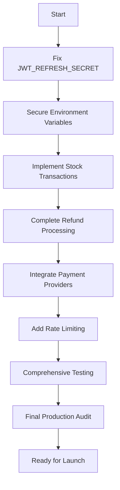

# Production Readiness Plan for Fullstack E-Commerce Platform

Based on the production audit, the project is currently **NOT READY** for launch. This plan outlines the critical fixes required to address the detected risks and make it production-safe.

## Current Status
- **Verdict**: NOT READY
- **Key Risks Identified**:
  - Missing JWT_REFRESH_SECRET (authentication failure)
  - Exposed MongoDB credentials in .env
  - Stock overselling due to lack of transactions
  - Incomplete refund processing (no restocking)
  - Pending payment status without completion
  - No rate limiting or DDoS protection

## Required Fixes (Priority Order)

### 1. Critical Security Fixes (Must Fix Before Launch)
#### JWT Refresh Token Configuration
- Add `JWT_REFRESH_SECRET` to `.env.example` and `.env`
- Ensure both access and refresh secrets are properly configured
- Test authentication flow with refresh tokens

#### Secure Environment Variables
- Remove hardcoded MongoDB URI from `.env`
- Implement proper secret management (environment variables, secret managers like AWS Secrets Manager or Vault)
- Update deployment configurations to use secure secrets

### 2. Data Integrity Fixes (Must Fix)
#### Stock Management Transactions
- Wrap order creation in MongoDB transactions to ensure atomic stock decrement
- Prevent race conditions that could lead to overselling
- Add proper error handling for transaction failures

#### Refund Processing Completion
- Implement automatic product restocking on successful refunds
- Update order and payment status correctly
- Add refund validation logic

### 3. Payment Integration (Must Fix for E-Commerce)
#### Complete Payment Flow
- Implement real payment provider integrations (Stripe, bKash, Nagad)
- Handle payment confirmation and order status updates
- Add webhook handling for payment events

### 4. Security Enhancements (Recommended)
#### Rate Limiting & DDoS Protection
- Implement rate limiting on API endpoints (express-rate-limit)
- Add basic DDoS protection (helmet configuration)
- Add CAPTCHA for sensitive operations

### 5. Testing & Validation
#### Comprehensive Testing
- Unit tests for critical business logic (cart, orders, stock)
- Integration tests for payment flows
- Load testing for concurrent orders
- Security testing (OWASP checks)

### 6. Monitoring & Deployment
#### Production Deployment Setup
- Configure proper logging (winston or similar)
- Set up health checks and monitoring
- Implement backup strategies for database
- Configure CI/CD pipelines with security scans

## Implementation Sequence

## Risk Assessment After Fixes
- **Authentication**: ✅ Secure with proper tokens
- **Data Integrity**: ✅ Transactions prevent overselling
- **Security**: ✅ Secrets managed properly, rate limiting added
- **Payments**: ✅ Complete integration
- **Performance**: ✅ Tested for concurrency

## Estimated Effort
(Note: This is a planning estimate, actual implementation time may vary)

- Critical Security: 4-6 hours
- Data Integrity: 6-8 hours
- Payment Integration: 8-12 hours
- Testing: 8-10 hours
- Total: ~26-36 hours for experienced developer

## Next Steps
1. Review and approve this plan
2. Switch to Code mode to implement fixes
3. Test each fix thoroughly
4. Perform final audit before launch

This plan addresses all detected risks while maintaining the existing architecture. No major refactors are required - just targeted fixes for production safety.